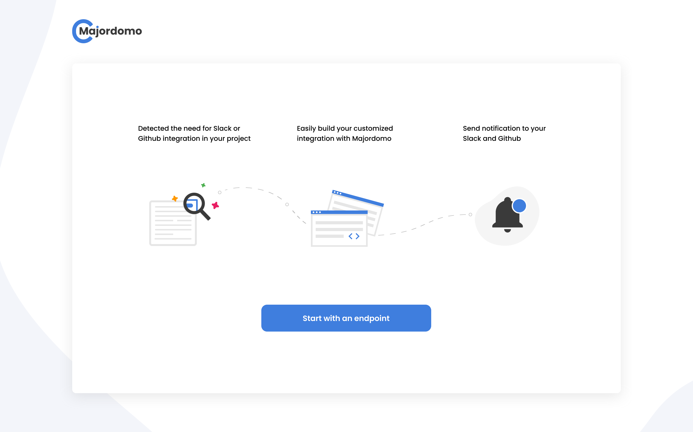
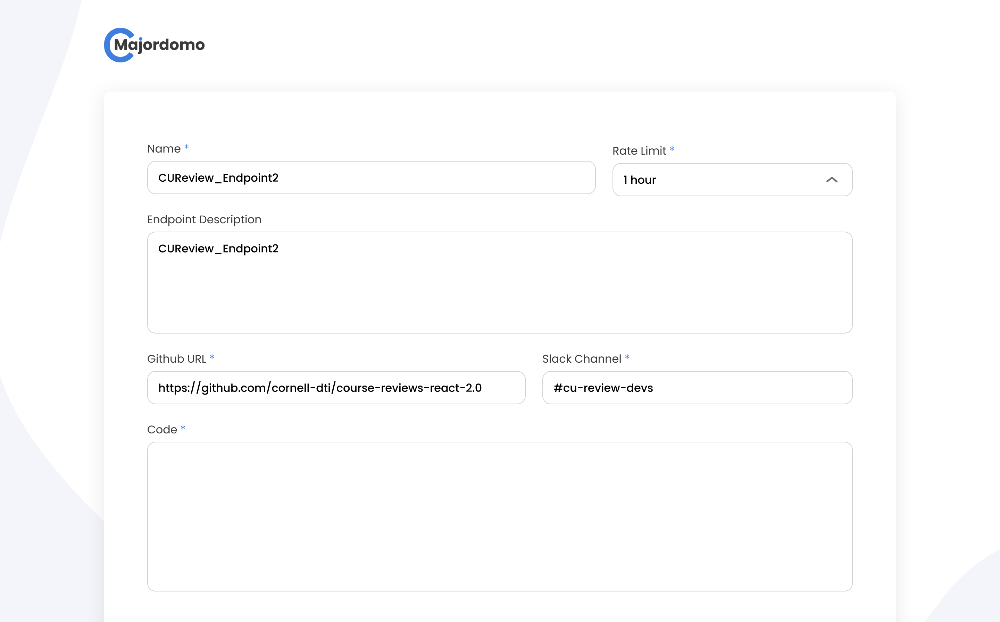
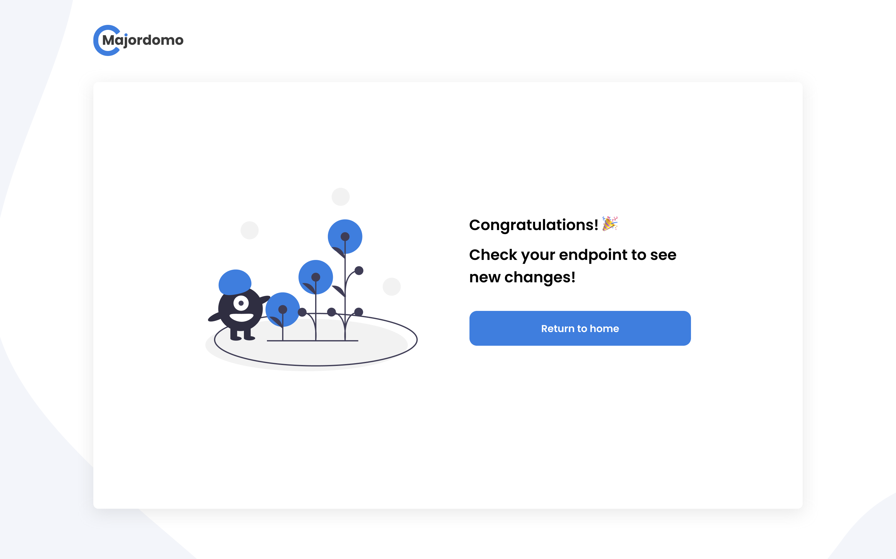

# DTI Majordomo


Easily integrate your project with slack and github! It's as simple as creating an endpoint.

### How to use:

You can access the majordomo website [here](https://khemritolya.github.io/dti-majordomo/)!



Simply follow the instructions, and set up your endpoint in no time. Note: It will prompt you for a "backend url". This is to prevent just anyone from creating and editing endpoints. 


Input your customizable code. Link your endpoint to a Github repo or a Slack channel. Later you can find the most recent backend url on slack in the #majordomo-testing-channel. 



Feel free to leave your feedback for us, and YOU ARE ALL SET!




### Example workflows:

You can see all of the example workflows after connecting to the backend.

Here is an example, which we use in majordomo to allow users to post suggestions to slack:

```javascript
// Get any JSON Data associated with the HTTP POST request
const data = getPostJson();

// Get the IP of whoever posted to the endpoint
const ip = getIpAddr();

// Post the 'text' field of the json to slack!
slackPost("A user (" + ip + ") has a suggestion: " + data.text);`
```

You can then call this endpoint on your backend/frontend/using curl, e.g:

```bash
curl -X POST -d 'text=You should implement feature foo' http://[address]:17760/custom-endpoints/majordomo-suggestion
```

In this case, you'll see the message show up in #majordomo-testing-channel ! Receiving user feedback has never been easier!

Note: the address does not include the obfuscation that is applied to the majordomo backend endpoints to query and modify existing user-defined endpoints.

### How to use slackPost and createGithubIssue

Consider the workflow code that we use to showcase github issues:

```javascript

// Get the IP of whoever posted to the endpoint
const ip = getIpAddr();

// Create an issue, we ran into a divide by zero!
// Create a callback to post about it on slack with the issue url! We wou;dn't want to miss it!
createGithubIssue("A user (" + ip + ") has caused a backend error ", " <! -- snip -->", function(issueUrl) {
    slackPost("<!channel> Heads up! A user (" + ip + ") ran into an issue: " + issueUrl)
});
 ```
 
##### `createGithubIssue(title, text, callback?)`

Calling this function creates a github issue in the repository defined (see the endpoint creation form on the frontend). On a success, it will then attempt to call the callback, if one is specified, and provide the url of the github issue it created. *In the example case, we use this to post about the issue we just created on slack* Unfortunatly, we don't yet support async. I'm so sorry.

##### `slackPost(text, callback?)`

Calling this function posts text to the slack channel that defined (again, see endpoint creation form). On a success, it will then attempt to call the callback, if one is specified. It provides no arguments to the callback.

